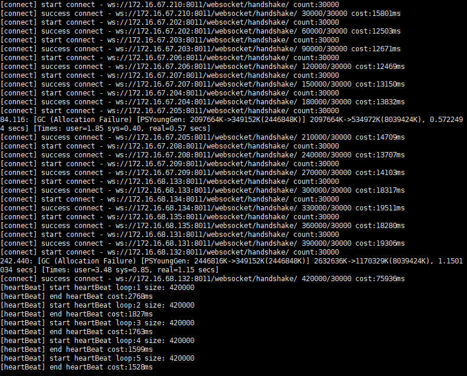

# 实际操作历史 

## 实践

### 第一次测试

```
mvn clean package -DskipTests
java -jar target/c10k-0.0.1.jar
```

在浏览器中

```
ws = new WebSocket("ws://localhost:8010/websocket/handshake?id=01")
```

### 0.0.1

- 2核8G 服务器 
- OpenJDK 64-Bit Server VM (build 25.275-b01, mixed mode)
- Linux version 4.18.0-193.28.1.el8_2.x86_64 (mockbuild@kbuilder.bsys.centos.org) (gcc version 8.3.1 20191121 (Red Hat 8.3.1-5) (GCC)) #1 SMP Thu Oct 22 00:20:22 UTC 2020
- 2核4G 客户端

- `java -jar target/c10k-0.0.1.jar`
    - 10000 连接
        - 服务器完全启动后, 约10秒可以接受 10000 新连接
        - 服务端 cpu 连接时, cpu 90%以上, 维护心跳时 45% 左右
    - 15000 连接
        - gc 大约10秒钟会进行一次 full gc
        - 维护心跳时 cpu: 60% ~ 80%
    - 20000 连接
        - gc 大约3秒钟会进行一次 full gc
        - 维护心跳时 cpu: 140%
- `java -Xmx6g -Xms6g -XX:+PrintGCDetails -XX:+PrintGCTimeStamps -XX:MetaspaceSize=96M -jar target/c10k-0.0.1.jar`
    - 这里主要提高堆大小, 以增加连接数, 使用 arthas 可以监控堆大小以及gc情况
    - 为了减少应用启动时 `Metadata GC Threshold` 导致的 full gc, 我这里还提高了 `MetaspaceSize` 的大小
    - 并且我们打印了 gc 情况, 方便排查问题
    - 20000 连接
        - 这里我们直接从 20000 连接开始测试
            - 这里我使用 arthas 进行监控
            - 从连接数0 到 连接数20000 的过程中一共发生 3 次年轻代GC , 总计 1203ms
            - 虽然没有发生 full gc 但这个时间我仍然无法忍受
    - 30000 连接
        - 维护心跳时 90% ~ 100%
    - 检查维护心跳带来开销, 去掉检查过期心跳, 已经更新维护心跳的数据结构
        - 30000 连接
            - 等待连接全部建立后, cpu 占用 90%~100%
    - 继续检查心跳, 但客户端心跳的发送间隔改为 5秒
        - 30000 连接
            - 等待连接全部建立后, cpu 占用 50% 左右
    - 不再判断 pong 消息中的 seq, 统一使用相同的 pong 消息, 心跳间隔为 5 秒
        -  30000 连接
            - 等待连接全部建立后, cpu 占用 40%~45% 
- `java -Xmx6g -Xms6g -XX:+PrintGCDetails -XX:+PrintGCTimeStamps -XX:+UseG1GC -jar target/c10k-0.0.1.jar`
    - 这里我使用了 g1gc 想要减少 gc 中 stop the world 等待时间
    - 20000 连接
        - 从连接数0 到 连接数20000 的过程中一共发生 9 次 young gc , 共计 1563ms
            - 虽然单次 gc 的平均时长比之前短, 但是总时长还增加了, 先不考虑 gc 方向的优化

### 0.0.2

- 启动命令
    - `java -Xmx6g -Xms6g -XX:+PrintGCDetails -XX:+PrintGCTimeStamps -XX:MetaspaceSize=96M -jar target/c10k-0.0.1.jar`
- 压测工具
    - 5秒心跳, 不判断 seq
- 主要优化 tomcat 参数
    - 代码 tag 0.0.2.1
        - springboot 内置 tomcat 优化
            - `server.tomcat.max-connections: 1010000`
            - `server.tomcat.accept-count: 1000`
            - `server.tomcat.threads.max: 400`
            - `server.tomcat.threads.min-spare: 100`
        - 30000 连接
            - 30秒左右到达 30000 连接, 等待连接全部建立后, cpu 占用 50% 左右
        - 40000 连接
            - 77 秒左右到达 35000 连接 
            - 132 秒左右到达 40000 连接
            - 猜测由于
        - 两台客户端, 每台 30000连接, 共 60000 连接
            - 服务器在 50000 多连接时, 报了很多错误
               - `w.s.h.ExceptionWebSocketHandlerDecorator : Closing session due to exception for StandardWebSocketSession[id=6cd1cf95-6bf6-8a79-9bc2-f44f7af1ac3f, uri=ws://172.16.67.198:8010/websocket/handshake/?id=8312_11790]  java.lang.IllegalStateException: Message will not be sent because the WebSocket session has been closed`
            - 这里我修复下 session close 时还发送消息抛出的异常
                - https://stackoverflow.com/questions/48319866/websocket-server-based-on-spring-boot-becomes-unresponsive-after-a-malformed-pac
- 使用 g1gc
    - 测试 tag: 0.0.2.2 发送消息时进行同步, 避免session已经关闭的情况下, 发送消息, 并优化日志打印;
    - 两台客户端, 每台 30000连接, 共 60000 连接
        - 60000 个客户端 , 连接成功
        - 但出现了多次 full gc, 甚至有长达 6 秒的 full GC
        - `535.208: [Full GC (Ergonomics) [PSYoungGen: 699392K->212554K(1398272K)] [ParOldGen: 4194037K->4194099K(4194304K)] 4893429K->4406653K(5592576K), [Metaspace: 35973K->35973K(1083392K)], 6.0255303 secs] [Times: user=10.68 sys=0.00, real=6.02 secs]`
    - 使用 G1GC `java -Xmx6g -Xms6g -XX:+PrintGCDetails -XX:+PrintGCTimeStamps  -XX:MetaspaceSize=96M -XX:+UseG1GC -jar target/c10k-0.0.1.jar`   
        - 还是 60000 个客户端, 没有发生 full gc
            - 但 young gc 还是很多的, 在连接到 60000 连接时, 大约花了 85 秒, 共 27次young gc, 6415ms
    - `-XX:MaxGCPauseMillis=80`
        - `java -Xmx6g -Xms6g -XX:+PrintGCDetails -XX:+PrintGCTimeStamps  -XX:MetaspaceSize=96M -XX:+UseG1GC -XX:MaxGCPauseMillis=80 -jar target/c10k-0.0.1.jar`
        - 这里测试时我加了最大gc延迟 2个客户端
        - 26次 young gc 6343ms
    - 4*30000=12W 个客户端 在 80000 多连接时, 发生 full gc 5.59s
        - `java -Xmx6g -Xms6g -XX:+PrintGCDetails -XX:+PrintGCTimeStamps  -XX:MetaspaceSize=96M -XX:+UseG1GC -XX:MaxGCPauseMillis=80 -jar target/c10k-0.0.1.jar`
        - 达到 82000 多个的时候, 一直在 full gc 几乎不能接受新连接
- 使用 4核16G的服务器
    - 将 heap 大小调为 12g
        -  `java -Xmx12g -Xms12g -XX:+PrintGCDetails -XX:+PrintGCTimeStamps  -XX:MetaspaceSize=96M -XX:+UseG1GC -XX:MaxGCPauseMillis=80 -jar target/c10k-0.0.1.jar`
    - 4*30000=12W 个客户端
        - 没有发生 full gc
        - 成功连接上 120000 个客户端

### 0.0.3

使用 netty 实现

- 第一次测试 0.0.3.1
    - `java -Xmx12g -Xms12g -XX:+PrintGCDetails -XX:+PrintGCTimeStamps  -XX:MetaspaceSize=96M -XX:+UseG1GC -XX:MaxGCPauseMillis=80 -jar target/c10k-0.0.1.jar`
        - 2台2核4G的客户端, 共计 18w 个 websocket 连接, 都连接成功
        - 由于使用的是 [go-stress-testing](https://github.com/link1st/go-stress-testing) 在当前内存下的客户端数已经是极限, 故目前只能通过增加服务器(作为 websocket 客户端), 或者使用其他方式实现 websocket client
- 启动客户端 `java -Xmx3g -Xms3g -cp target/c10k-0.0.1.jar -Dloader.main=me.giraffetree.websocket.c10k.client.ClientStarter org.springframework.boot.loader.PropertiesLauncher --help`
    - 启动客户端 `java -Xmx3g -Xms3g -XX:+PrintGCDetails -XX:+PrintGCTimeStamps -cp target/c10k-0.0.1.jar -Dloader.main=me.giraffetree.websocket.c10k.client.ClientStarter org.springframework.boot.loader.PropertiesLauncher -c 20000 -h 172.16.67.210,172.16.67.202,172.16.67.203,172.16.67.206,172.16.67.207,172.16.67.204,172.16.67.205,172.16.67.208,172.16.67.209,172.16.68.133,172.16.68.134,172.16.68.135,172.16.68.131,172.16.68.132`
        - 这个命令行是在 2核4G的服务器上执行的 大约到 264000 连接时, 程序卡住了, 原因未知
        - 打算使用 `nohup {命令} > logs/clients.log 2>&1 &`再启动一次试试
            - 尝试过程中出现过一些异常, 调整了 jvm 与 tcp 的一些参数
            - `java.lang.OutOfMemoryError thrown from the UncaughtExceptionHandler in thread "main"`
            - `TCP: too many orphaned sockets`
        - 调整 jvm 参数后
            - 连接数增长到 377000 , 然后程序卡死了...
            - 估计差不多到极限了, 等会儿换台大内存的服务器再试试
- 新买了两台 4核16G 服务器 A,B , 加上之前一台 2核4G 服务器 C 均作为客户端 
    - 在服务器 A, B 上启动客户端 `java -Xmx8g -Xms8g -XX:+PrintGCDetails -XX:+PrintGCTimeStamps -cp target/c10k-0.0.1.jar -Dloader.main=me.giraffetree.websocket.c10k.client.ClientStarter org.springframework.boot.loader.PropertiesLauncher -c 30000 -h 172.16.67.210,172.16.67.202,172.16.67.203,172.16.67.206,172.16.67.207,172.16.67.204,172.16.67.205,172.16.67.208,172.16.67.209,172.16.68.133,172.16.68.134,172.16.68.135,172.16.68.131,172.16.68.132`  heap 大小根据服务器配置决定, 这里大约会启动 42w连接 , 两台共 84w
        -  在服务器 C 上启动客户端 `java -Xmx2500M -Xms2500M -XX:+PrintGCDetails -XX:+PrintGCTimeStamps -cp target/c10k-0.0.1.jar -Dloader.main=me.giraffetree.websocket.c10k.client.ClientStarter org.springframework.boot.loader.PropertiesLauncher -c 13000 -h 172.16.67.210,172.16.67.202,172.16.67.203,172.16.67.206,172.16.67.207,172.16.67.204,172.16.67.205,172.16.67.208,172.16.67.209,172.16.68.133,172.16.68.134,172.16.68.135,172.16.68.131,172.16.68.132` 这里大约会启动 18w 连接
    - websocket 100 w 连接达成!!! java 程序常驻内存仅占用 3.5g 
    - 
    - 连接速度以 15000ms 建立 30000连接计算, 每秒可建立 websocket 长连接 2000 个左右
    - 

