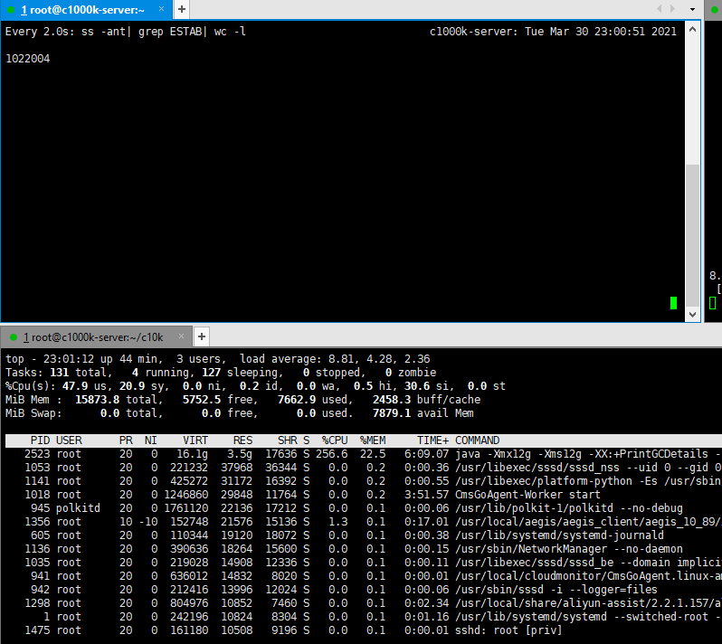

# websocket 百万连接及心跳管理

## 概述

### 场景与模型

有很多物联网设备通过 websocket 协议连接到服务器, 每个设备有一个唯一的 id (比如mac地址)

### 判断指标

1. 连接数 
2. 连接速率  
3. 过期连接删除速率

### roadmap

1. 单机 100w websocket 长连接
2. 单机 100w websocket 长连接 + 心跳检查, 过期连接删除 (doing... 预计 2021.04.03 前完成) 
3. nginx 前置代理/负载均衡 100w websocket 长连接
4. 单机 1000w tcp 连接
5. 单机 1000w websocket 长连接

### 实际测试结果图

- 连接数 
    - 4核16G的server端, 建立 100w websocket 长连接

## 如何使用

1. 打包
    - `mvn clean package -DskipTests`
2. 启动 websocket 服务端
    - `java -jar target/c10k-0.0.1.jar`
3. 启动 websocket 客户端
    - `java -cp target/c10k-0.0.1.jar -Dloader.main=me.giraffetree.websocket.c10k.client.ClientStarter org.springframework.boot.loader.PropertiesLauncher` 默认
    - 查看参数默认参数: `java -cp target/c10k-0.0.1.jar -Dloader.main=me.giraffetree.websocket.c10k.client.ClientStarter org.springframework.boot.loader.PropertiesLauncher --help` 

